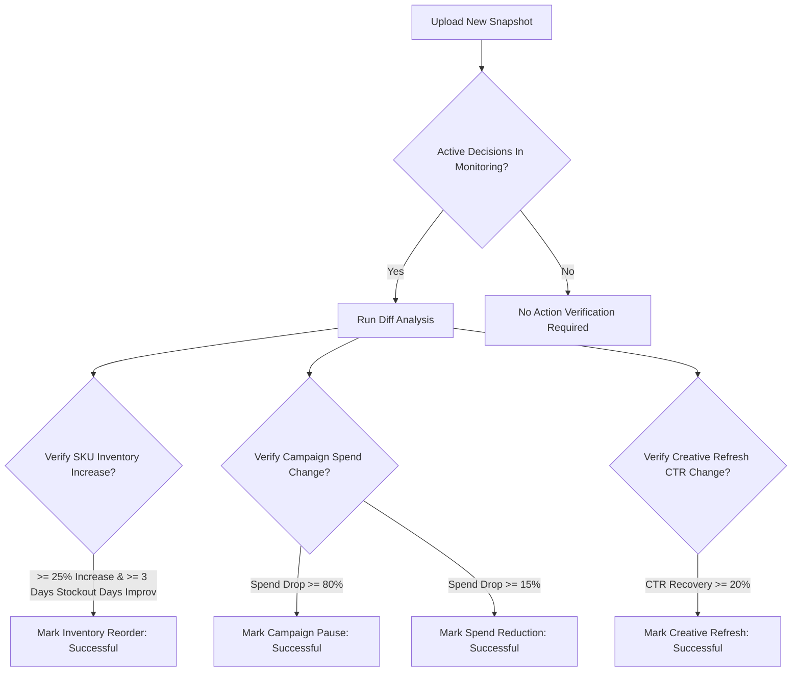

# Physisync Commerce Engine: Calculation Fundamentals & Decision Logic Whitepaper

This document provides a comprehensive mathematical and logic reference for the **Physisync** operational observability platform. It is designed for founders, operations leads, media buyers, and developers who want to verify the mathematical soundness and core principles of Physisync's calculations.

---

## 1. Core Philosophy: Why Placed Metrics Lie

Most e-commerce platforms (like Shopify or Meta Ads) calculate key performance indicators (KPIs) based on **placed orders**. In the Indian Direct-to-Consumer (D2C) ecosystem, where **Cash on Delivery (COD)** represents 50% to 80% of total order volume, placed metrics fail to represent business reality:
1. **High Return to Origin (RTO) Rates**: 20% to 40% of COD orders are returned before delivery, incurring two-way logistics costs without generating revenue.
2. **Inflated ROAS**: Meta Ads reports Return on Ad Spend (ROAS) based on placed order value. If 30% of those orders are returned, the *realized* ROAS is substantially lower than reported.

**Physisync's Core Value Proposition**: We unify Meta Ads spend data with Shopify order fulfillment/delivery statuses to calculate **delivered-order metrics (Realized Metrics)**. Decisions are driven by cash actually collected, not top-line promises.

---

## 2. Fundamental Commerce Formulas

### 2.1 Return to Origin (RTO) Rate
RTO rate is mathematically calculated using **delivered (fulfilled) orders as the denominator**, rather than placed orders. This prevents cancelled or unfulfilled orders from skewing return rates.

> **Formula:**  
> **RTO Rate (%)** = `(Returned Orders / Delivered Orders) * 100`

*   **Attributed Campaign RTO**: When tracking specific marketing campaigns, the engine attributes Shopify order delivery statuses to the campaign traffic:
    > **Attributed Campaign RTO (%)** = `(Attributed RTO Count / Attributed Delivered Orders) * 100`
    
    *   *Default Attribution Proxy*: For mock/demo data and newly ingested spreadsheets where exact courier tracking is missing, COD orders default to a **31% RTO rate** based on industry benchmarks.

---

### 2.2 Realized Return on Ad Spend (Realized ROAS)
Unlike "Placed ROAS" which uses total checkout value, **Realized ROAS** measures actual revenue realized after logistics delivery success.

> **Formula:**  
> **Realized ROAS** = `Revenue from Delivered Orders / Ad Spend`

*   **Deriving Realized ROAS from Placed ROAS**: If ad spend and placed ROAS are known, Realized ROAS is compressed proportionally by the RTO rate:
    > **Realized ROAS** = `Placed ROAS * (1 - (RTO Rate (%) / 100))`
    
    *   *Example*: A campaign with a placed ROAS of **3.0x** and a **30% RTO rate** has a Realized ROAS of:
        `3.0 * (1 - 0.30) = 2.1x`

---

### 2.3 Projected Stockout Days
Measures how many days of inventory remain for a specific SKU based on current sales velocity.

> **Formula:**  
> **Projected Stockout Days** = `Inventory Left (Units) / Daily Sales Velocity (Units/Day)`

*   **Daily Velocity Calculation**:
    *   *Unified Uploads*: Calculated dynamically as the current rate of unit sales.
    *   *Single-sheet Shopify Order Uploads*: Calculated as:
        > **Daily Sales Velocity** = `Total Units Sold in Uploaded Period / Number of Unique Dates in Dataset`

---

## 3. Dynamic Confidence & Freshness Engine

Signals generated by Physisync carry a **Confidence Score** (0.0 to 1.0). This score is not static; it dynamically decays based on data age (freshness) and cross-system alignment.

> **Formula:**  
> **Confidence Score** = `Base Confidence * Freshness Factor * Alignment Multiplier`

### 3.1 Data Freshness Factor
The engine parses date/time columns in uploaded sheets and calculates the age of the newest record:

> **Data Age (Days)** = `Current UTC Time - Timestamp of Newest Record`

| Data Age | Freshness Factor | Description |
| :--- | :--- | :--- |
| **<= 1 Day** | `1.00` | Real-time / highly fresh data |
| **1 to 3 Days** | `0.88` | Minor latency |
| **3 to 7 Days** | `0.75` | Moderate latency |
| **> 7 Days** | `0.50` | Stale data (high penalty) |
| *No Date Parsed* | `0.95` | Fallback default |

### 3.2 Alignment Multiplier
*   **Alignment Confirmed (`1.00`)**: Downstream validation is present (e.g., Shopify COD ratios match elevated RTO spikes in Meta Ads).
*   **Alignment Limited (`0.85`)**: No downstream cross-correlation is available, applying a 15% penalty to the confidence score.

---

## 4. Signal Detection Heuristics & Impact Calculations

Physisync runs deterministic, threshold-based rules to generate actionable alerts. Each alert includes a mathematically computed **Business Impact** representing revenue/margin at risk. Below is the exact step-by-step breakdown of how these risks are calculated:

### 4.1 Inventory Risk (High Severity)
*   **Condition**: Ad spend is accelerating (driving up demand) while inventory cover falls below a critical weekly threshold.
*   **Heuristic Rule**:
    `Projected Stockout Days <= 7` AND `Weekly Spend Growth >= 15%`
*   **Base Confidence**: 82% (`0.82`)

#### 📊 Business Impact Formula (Revenue at Risk):
```
Revenue at Risk = Daily Sales Velocity * AOV * min(Projected Stockout Days, 7)
```
*   **Daily Sales Velocity**: The rate of units sold per day for this specific SKU (extracted from the `inventory` or `shopify_orders` sheet).
*   **AOV (Average Order Value)**: Blended store-wide average order value dynamically calculated from the `shopify_orders` sheet as `Total Sales / Total Placed Orders`.
*   **min(Projected Stockout Days, 7)**: The stockout duration window, capped at a maximum of 7 days (1 week) to represent immediate near-term operational risk.
*   **Example Calculation**:
    *   *SKU*: "Legend Sneaker" (Inventory Left = 30 units, Daily Sales Velocity = 10 units/day)
    *   *AOV*: Rs. 1,500
    *   *Weekly Spend Growth*: 18% (Alert Triggered! Stockout days = 30 / 10 = 3 days, which is <= 7 days)
    *   *Risk Window*: `min(3, 7) = 3 days`
    *   *Revenue at Risk Calculation*:
        `10 units/day * Rs. 1,500 * 3 days = Rs. 45,000`
        *Physisync flags **Rs. 45,000** as high-severity Revenue at Risk.*

---

### 4.2 Campaign RTO Spike (High Severity)
*   **Condition**: A specific ad campaign is driving a disproportionate volume of Cash on Delivery orders that result in RTOs, compressing margins below thresholds.
*   **Heuristic Rule**:
    `Attributed RTO Rate >= 25%` AND `COD Order Count >= 50`
*   **Base Confidence**: 88% (`0.88`)

#### 📊 Business Impact Formula (Daily Margin Loss):
```
Daily Spend = Weekly Campaign Spend / 7
Daily Margin Loss = Daily Spend * Placed ROAS * (Contribution Margin % / 100) * max(1 - (Delivered ROAS / Placed ROAS), 0)
```
*(Enforced floor: Rs. 500/day)*
*   **Daily Spend**: Total ad spend on this campaign in the last 7 days, divided by 7 to convert it to a daily rate.
*   **Placed ROAS**: The ROAS reported on checkout (placed orders) in Meta Ads.
*   **Delivered ROAS**: Realized ROAS based only on delivered/paid orders.
*   **Contribution Margin %**: The net profit margin after RTO and courier fees (calculated as `28 - (RTO Rate * 0.65)` in tasks).
*   **max(1 - (Delivered ROAS / Placed ROAS), 0)**: The fraction of ad-generated revenue that was completely wiped out by shipping returns. If Delivered ROAS equals Placed ROAS, this factor is `0`.
*   **Example Calculation**:
    *   *Campaign*: "Prospecting_Tier2" (Weekly Spend = Rs. 70,000 -> Daily Spend = Rs. 10,000)
    *   *Metrics*: Placed ROAS = 3.0x, Delivered ROAS = 2.0x (RTO Rate = 33%)
    *   *Contribution Margin*: 10%
    *   *Fraction Lost*: `1 - (2.0 / 3.0) = 0.333` (33.3% of revenue lost to returns)
    *   *Daily Margin Loss Calculation*:
        `Rs. 10,000 * 3.0 * (10 / 100) * 0.333 = Rs. 1,000 / day`
        *Physisync flags **Rs. 1,000 / day** as active Daily Margin Loss.*

---

### 4.3 Creative Fatigue (Medium Severity)
*   **Condition**: High ad creative exposure frequency coupled with a drop in click-through rates (CTR).
*   **Heuristic Rule**:
    `Creative Frequency >= 4.0` AND `CTR Drop >= 20%`
*   **Base Confidence**: 76% (`0.76`)

#### 📊 Business Impact Formula (Spend Efficiency at Risk):
```
Spend Efficiency at Risk = Weekly Campaign Spend * (CTR Drop % / 100)
```
*(Enforced floor: Rs. 1,000)*
*   **Weekly Campaign Spend**: Total ad spend on this campaign in the last 7 days.
*   **CTR Drop %**: The percentage drop in Click-Through Rate compared to the previous week (e.g. `(Previous CTR - Latest CTR) / Previous CTR * 100`).
*   **Why it represents risk**: A 20% drop in CTR means you are acquiring 20% fewer website visitors for the exact same ad spend. Thus, 20% of your ad spend is completely wasted on an exhausted audience.
*   **Example Calculation**:
    *   *Campaign*: "UGC_Reels_Scale" (Weekly Spend = Rs. 50,000)
    *   *CTR metrics*: Previous Week CTR = 2.5%, Current Week CTR = 1.9% (Drop = `(2.5 - 1.9) / 2.5 = 24%`)
    *   *Spend Efficiency at Risk Calculation*:
        `Rs. 50,000 * (24 / 100) = Rs. 12,000`
        *Physisync flags **Rs. 12,000** as Spend Efficiency at Risk due to creative fatigue.*

---

### 4.4 Margin Leakage (High Severity)
*   **Condition**: Customer segment has high COD preference and elevated return rates, despite healthy placed ROAS.
*   **Heuristic Rule**:
    `COD Ratio >= 60%` AND `Delivered RTO Rate >= 18%` AND `Placed ROAS >= 3.0`
*   **Base Confidence**: 85% (`0.85`)

#### 📊 Business Impact Formula (Margin Leakage):
```
Margin Leakage = Blended Campaign Spend * (RTO Rate % / 100) * 0.40
```
*(Enforced floor: Rs. 2,000)*
*   **Blended Campaign Spend**: The total ad spend across all ad sets targeting this customer segment/SKU.
*   **RTO Rate %**: The return rate on delivered orders for this segment.
*   **0.40 (Operational Waste constant)**: Industry benchmark representing the cost of RTO. Every returned order wastes approximately 40% of the customer acquisition and operational spend in two-way courier shipping fees, packaging damage, warehouse restocking labor, and shelf-life decay.
*   **Example Calculation**:
    *   *Segment*: "Tier 2 COD Buyers" (Blended Campaign Spend = Rs. 1,00,000)
    *   *Metrics*: COD Ratio = 70%, Delivered RTO Rate = 25% (Alert Triggered!)
    *   *Margin Leakage Calculation*:
        `Rs. 1,00,000 * (25 / 100) * 0.40 = Rs. 10,000`
        *Physisync flags **Rs. 10,000** as wasted capital directly leaked into return logistics.*

---

### 4.5 Scaling Opportunity (Low Severity)
*   **Condition**: Campaign shows exceptional profit margins, high prepaid mix (low return rate), strong repeat purchase customer cohorts, and safe inventory cover.
*   **Heuristic Rule**:
    `Delivered ROAS >= 4.0` AND `Delivered RTO Rate <= 7%` AND `Repeat Rate >= 25%` AND `Contribution Margin >= 30%` AND `Projected Stockout Days >= 14`
*   **Base Confidence**: 79% (`0.79`)

#### 📊 Business Impact Formula (Incremental Revenue Opportunity):
```
Incremental Revenue Opportunity = Weekly Campaign Spend * 0.25 * Delivered ROAS
```
*(Enforced floor: Rs. 5,000)*
*   **Weekly Campaign Spend**: Current weekly ad spend on this campaign.
*   **0.25 (25% Scaling standard)**: The standard conservative budget increase recommended by media buyers to scale campaigns without disrupting the ad delivery algorithm.
*   **Delivered ROAS**: Realized ROAS (actual cash collected).
*   **Example Calculation**:
    *   *Campaign*: "Prepaid_Retargeting_LTV" (Weekly Spend = Rs. 40,000)
    *   *Metrics*: Delivered ROAS = 5.0x, RTO Rate = 4% (Alert Triggered!)
    *   *Incremental Revenue Opportunity Calculation*:
        `Rs. 40,000 * 0.25 * 5.0 = Rs. 50,000`
        *Physisync flags **Rs. 50,000** as untapped Incremental Revenue Opportunity.*

---

## 5. Closed-Loop Action Verification Model

Physisync is not just a dashboard; it is a **closed-loop system**. When an operator takes a recommended action (e.g., pausing a campaign or replenishing stock), the system verifies the action's execution and success by running differential checks between snapshots:

> **% Change Formula:**  
> **% Change** = `((Latest Metric - Previous Metric) / Previous Metric) * 100`

### 5.1 Verification Thresholds



*   **Inventory Reorder Verification**:
    *   *Condition*: Inventory Level Increase >= 25% AND Projected Stockout Days Improvement >= 3 days.
    *   *Verification Confidence*: 81% (`0.81`)
*   **Campaign Pause Verification**:
    *   *Condition*: Flagged Campaign Spend Drop >= 80%.
    *   *Verification Confidence*: 91% (`0.91`)
*   **Spend Reduction Verification**:
    *   *Condition*: Campaign Spend Decrease >= 15%.
    *   *Verification Confidence*: 77% (`0.77`)
*   **Creative Refresh Verification**:
    *   *Condition*: CTR Recovery >= 20% (acting as fatigue score decay proxy).
    *   *Verification Confidence*: 74% (`0.74`)

If any condition matches, Physisync transitions the decision state from `monitoring` to `successful`, logs the outcome in the brand scorecard, and updates the dynamic confidence engine!

---
*Document compiled and verified directly from the `Physisync Commerce Engine Core` source code.*
